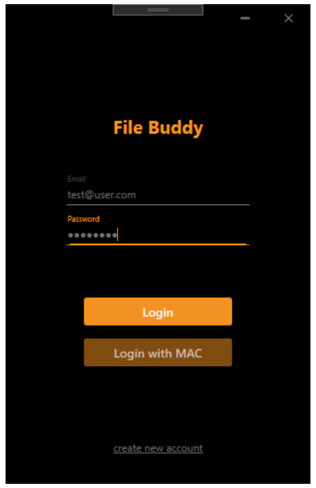
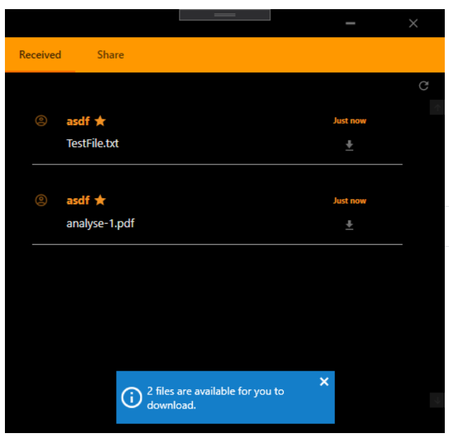
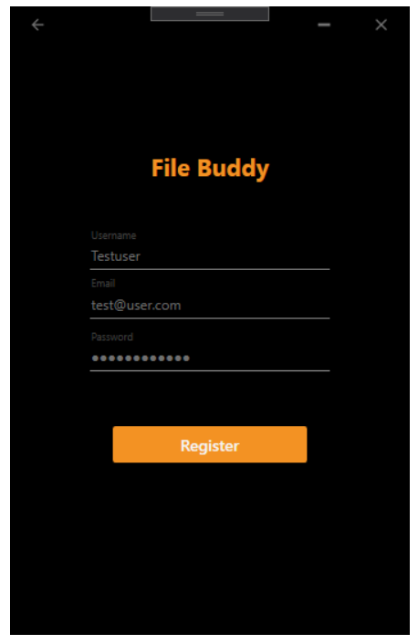
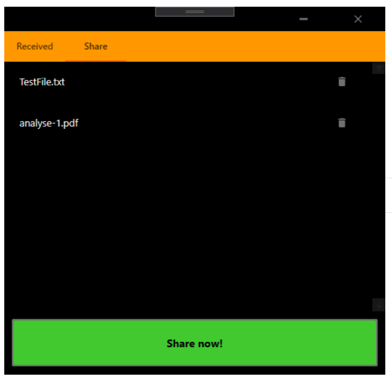

# FileBuddy
**EDUCATION Repository**

This Repository is part of an educational course of University of Applied Science -  [FH JOANNEUM GmbH](https://www.fh-joanneum.at/iit).

Bachelor program:

-   [Mobile Software Development]([https://www.fh-joanneum.at/mobile-software-development/bachelor/](https://www.fh-joanneum.at/mobile-software-development/bachelor/))  (FH JOANNEUM)

**Course:**

-  Web Service Development

## Introduction
There are two user interfaces planned for the interaction with the API. At the current moment (2020-05-17) the first protoype for the desktop application is lauchned. This WPF (= Windows Presentation Foundation) application provides the registeration of user, as well as Mail+Password logging and basic file sharing.

For demo pruposes files are automatically shared with the sender.

## Basic application layout
By design, the main window is organized into two tabs *Received*, showing all files you are able to download with double click, and *Share*, which provides a drag-and-drop function to place the files you want to share.

Currently the received list must be updated manually (refresh button; top-right corner).

### Login screen

### Register screen

### Main screen - "Received"

### Main screen - "Share"

