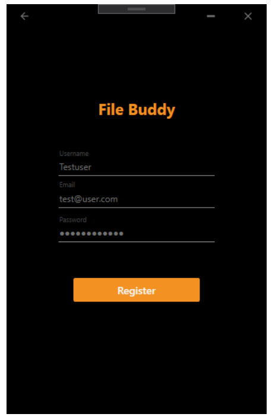
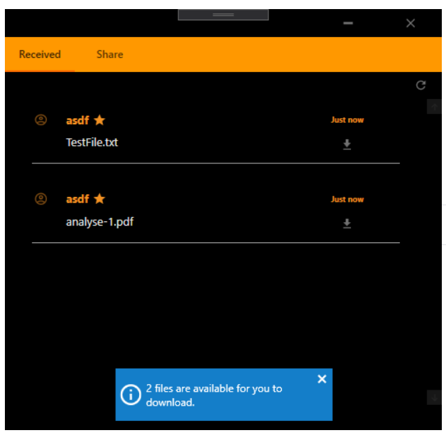

# FileBuddy

**EDUCATION Repository**

This Repository is part of an educational course of University of Applied Science - [FH JOANNEUM GmbH](https://www.fh-joanneum.at/iit).

Bachelor program:

- [Mobile Software Development](<[https://www.fh-joanneum.at/mobile-software-development/bachelor/](https://www.fh-joanneum.at/mobile-software-development/bachelor/)>) (FH JOANNEUM)

**Course:**

- Web Service Development

## Introduction

In course of this project, a file sharing platform was implemented, which enables the easy transfer of various files between end devices.

The following implementations are planned/done:

- [x] Web API (C# .Net Core 3) for management of master data
- [x] WPF application to enable user interactions
- [x] Web socket server for sending realtime notifications to users

## Execution of the project

The project was developed in the [Visual Studio 19 Community Edition](<[https://visualstudio.microsoft.com/de/vs/](https://visualstudio.microsoft.com/de/vs/)>). In order to start the application for testing purposes (API + UI) do the following:

1. Open the solution file in VS 19 _(relative path: file-buddy-resources\Program\FileBuddy\ FileBuddyProgram.sln)_
2. Click right on the display solution 'FileBuddyProgram' _(default: right hand side of the screen)_ and open the **Properties** window.
3. Activate the **Multiple startup projects:** radiobutton and select **Start** at the actions for the projects _API_, _FileBuddyUI_ and _WebSocketServerUI_.
4. Press **Apply** and **OK**
5. Now, press the **Start** button on the top-middle of the window.

After this, the follwing windows should open (mind that building process might take a long at the first time):

- Console of API with start up information
- Desktop client
- Browser window (default browser) with [Swagger UI](https://swagger.io/tools/swagger-ui/) API documentation

## Backend implementation

The backend of the project (implement in C# .Net Core 3) contains a Web Api, which provides methods for registering a new user, login of existing useres, and up- and downloading files.

All data is saved in an integrated SQLite database and uploaded files are managend by the API itself.  
By default the Api starts at https://localhost:5001 and http://localhost:5000.

## User interface (WPF)

At the current moment (2020-06-22) the first protoype for the desktop application is lauchned. This WPF (= Windows Presentation Foundation) application provides the registeration of user, as well as Mail+Password logging and basic file sharing.

For demo pruposes files are automatically shared only with the sender.

### Basic application layout

By design, the main window is organized into two tabs _Received_, showing all files you are able to download with double click, and _Share_, which provides a drag-and-drop function to place the files you want to share.

Currently the received list must be updated manually (refresh button; top-right corner).

#### Login screen

#### Register screen

#### Main screen - "Received"

#### Main screen - "Share"

